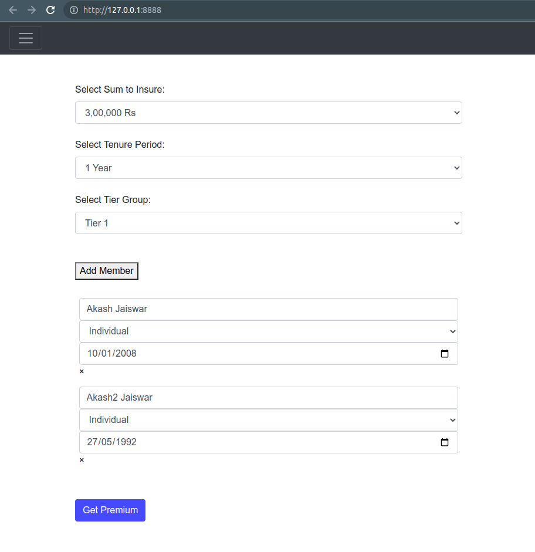
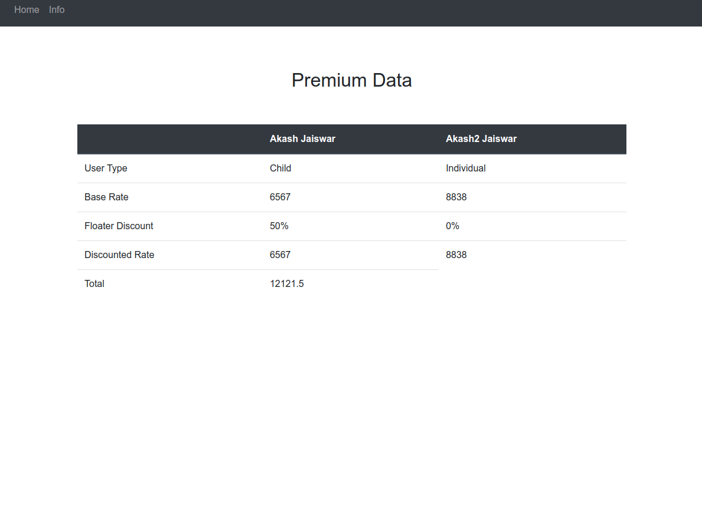

### Please follow the following steps if you wish to setup the project locally

1. git clone https://github.com/DolanDark/job_assignment_oneassure.git

2. cd job_assignment_oneassure/

3. python3 -m venv venv (run this if venv isnt installed >> "sudo apt-get install -y python3-venv")

4. source venv/bin/activate

5. pip install -r requirements.txt

6. python3 app.py


### Route information

1. "/" or "/home" - default homepage which takes user input with dynamic member addition.

2. "/calculate_premium" - api to get sheet data and calculate the premium on the basis of the payload

    Example Request - 
    ```
    {
        "sumInsured": "300000",
        "tenure": "1",
        "cityTier": "1",
        "memberList": [
            {
                "name": "Akash1",
                "type": "individual",
                "age": "1992-05-10"
            },
            {
                "name": "Akash2",
                "type": "individual",
                "age": ""1994-07-16""
            }
        ]
    }
    ```
    Response - The data is store in the sessions and then rendered in the "/result" route upon redirection.

3. "/result" - Route that gives the result table after taking in the data array generated in "calculate_premium".

4. "/update_premium_sheet" - Updates the sheetdata stored on the mongo cluster with the local datasheet available.

<br/><br/>
<br/><br/>


